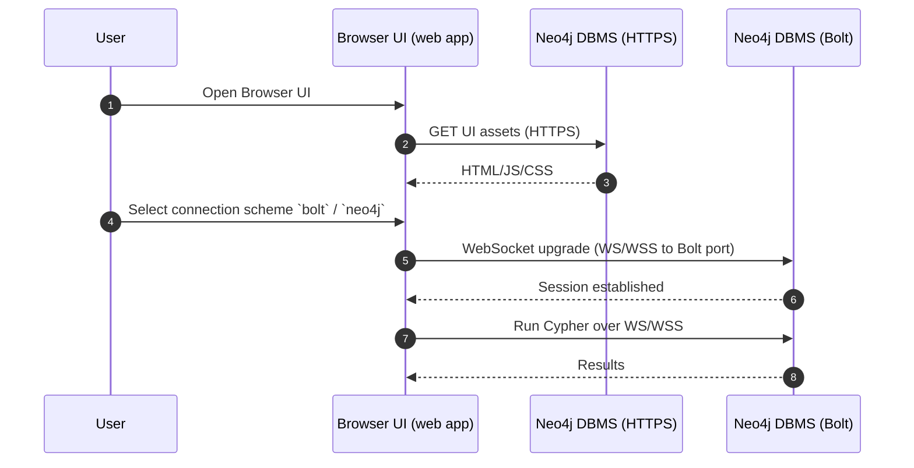
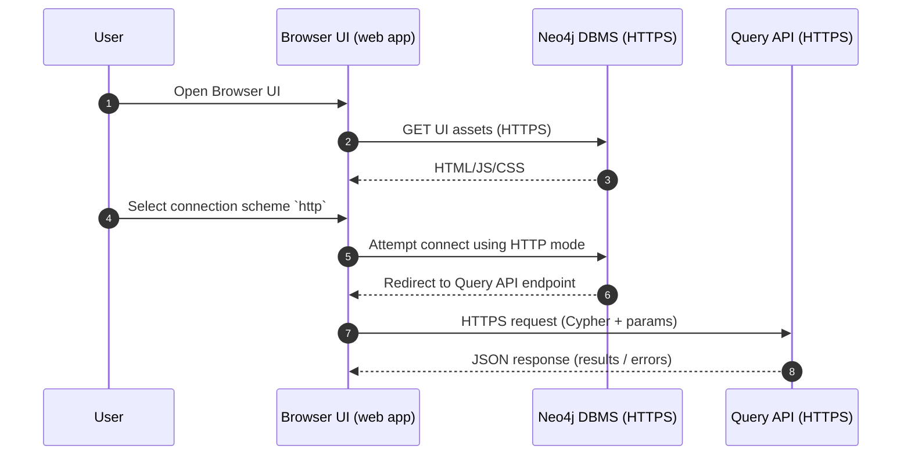
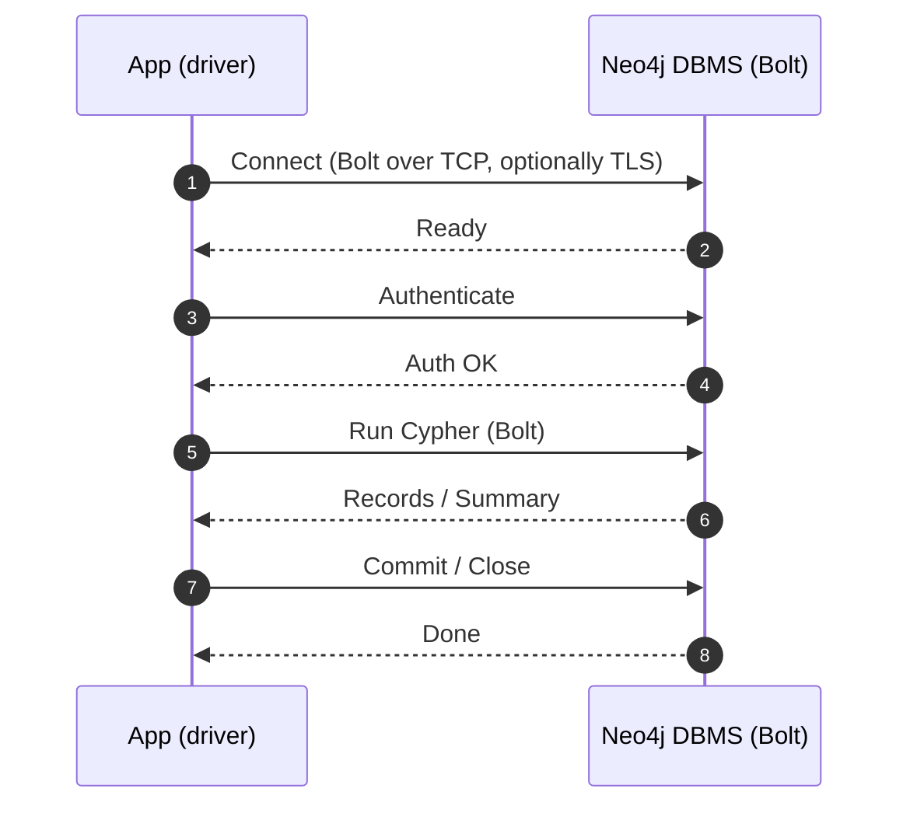
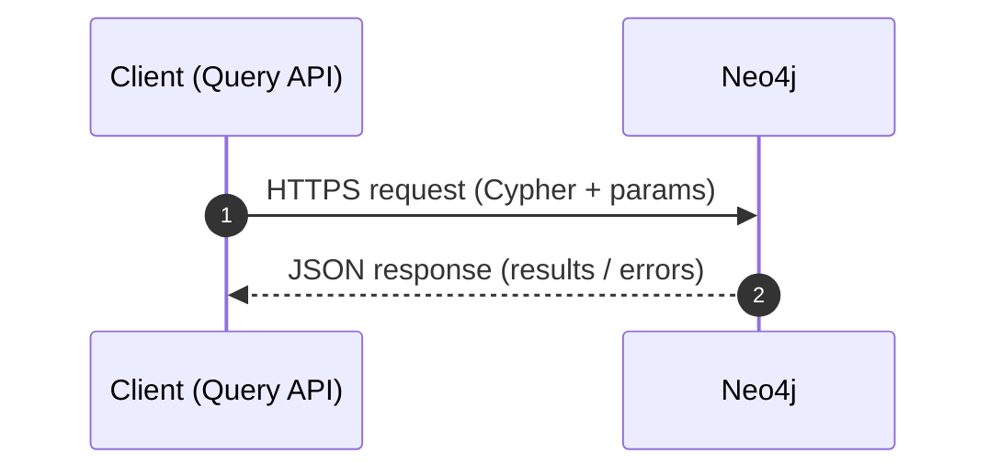

# Neo4j connectivity (HTTP/HTTPS, Bolt, WS/WSS)

This page summarizes the main ways applications and tools connect to Neo4j:

- **HTTP / HTTPS**: web APIs and web UIs (request/response)
- **Bolt (TCP)**: Neo4j’s primary binary protocol for drivers (low latency)
- **WS / WSS**: WebSocket transport used when a **browser-based** client must speak Bolt-like traffic

Defaults are commonly **7474 (HTTP)**, **7473 (HTTPS)**, **7687 (Bolt)**, but ports and exposure depend on your deployment and are often placed behind a reverse proxy.

## Which client uses which access

### Neo4j Browser (web UI)

- **What it is**: a web application (HTML/JS) used interactively.
- **How it reaches Neo4j**:
	- Loads the UI assets via the **DBMS HTTPS endpoint**.
	- Then, for queries, if you picked : 
		-  BOLT/NEO4J : opens a **WS/WSS** connection that targets the **DBMS Bolt port** to carry Cypher traffic.
		- HTTPS : it will go over HTTPS to the query API.

Practical implication: if you can open Neo4j Browser but cannot run queries when you selected `bolt`/`neo4j`, it can be a sign that **Bolt TCP (typically 7687)** is not reachable even though HTTPS works.

#### Sequence diagram (user selects `bolt` / `neo4j`)

Bolt TCP must be reachable in this case.

#### Sequence diagram (user selects `http(s)`)

In this case the Browser uses **HTTPS** and is redirected to a **Query API** endpoint.

### Official drivers (applications)

- **Most server-side apps** use a driver over **Bolt (TCP)**.
- Drivers handle:
	- connection pooling
	- authentication
	- routing (for clusters) when using a routing scheme (often `neo4j://...` variants)

- **Java driver** can use either Bolt or HTTPS Query API (preview)
- **Node.js JS driver**: can use either Bolt or Bolt over WebSocket
- **Browser JS**: cannot open arbitrary TCP sockets, so it uses **WebSocket (WS/WSS)** to reach Neo4j through a websocket-capable endpoint.

#### Sequence diagram

### “Connectors” (ETL, streaming, BI, integrations)

Connectors typically choose one of these patterns:

- **Driver-based**: uses Bolt (best for Cypher + transactions)
- **HTTP-based**: uses HTTP APIs (often simpler networking, but not always feature-complete for Cypher workloads)

When evaluating a connector, check which protocol it uses so you can expose only what’s needed.

### Query API connections (HTTP/HTTPS)

- Used when a client cannot (or should not) use Bolt.
- Typically request/response over **HTTPS**, with Cypher and parameters encoded in the request.

#### Sequence diagram

